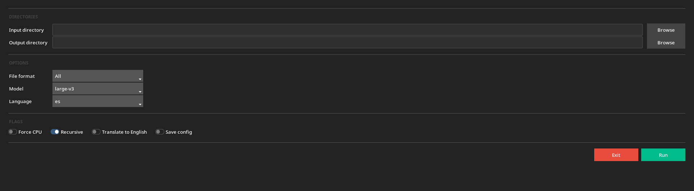

# subsgen

Tool to auto-generate subtitles for video and audio files using Whisper AI, with both a graphical interface and a command-line interface.

## Screenshot



## How it works

subsgen uses [faster-whisper](https://github.com/SYSTRAN/faster-whisper) to transcribe audio and video files and saves the output as `.srt` subtitle files alongside the source files, or to a specified output directory.

## Requirements

- Python 3.10+
- [uv](https://docs.astral.sh/uv/getting-started/installation/) (recommended) or pip
- NVIDIA GPU with CUDA (optional, falls back to CPU automatically)

## Installation

**With uv (recommended):**
```bash
git clone https://github.com/PenaflorPhi/subsgen
cd subsgen
uv tool install .
```

**With pip:**
```bash
git clone https://github.com/PenaflorPhi/subsgen
cd subsgen
pip install .
```

## Usage

### GUI
```bash
subsgen --gui
```

### CLI
```bash
# Transcribe all media files in the current directory
subsgen

# Transcribe a specific file or directory
subsgen ./videos
subsgen video.mp4

# Write subtitles to a separate output directory
subsgen ./videos --output ./subtitles

# Filter by format
subsgen ./videos --file_format mkv
subsgen ./videos --file_format mp4,mkv,mp3

# Use a specific model
subsgen ./videos --model large-v3

# Specify audio language
subsgen ./videos --language es

# Translate audio to English
subsgen ./videos --translate

# Search subdirectories
subsgen ./videos --recursive

# Force CPU
subsgen ./videos --cpu

# Verbose output
subsgen ./videos --verbose

# List available models
subsgen --list-models

# Save current settings as default
subsgen ./videos --model small --language es --save-config
```

## Supported formats

**Video:** mp4, mkv, avi, mov, wmv, flv, webm, m4v
**Audio:** mp3, wav, aac, ogg, flac, m4a, wma

## Models

subsgen supports all standard and distilled Whisper models. Run `subsgen --list-models` to see the full list.

| Model | Speed | Accuracy |
|-------|-------|----------|
| `tiny` | fastest | lowest |
| `base` | fast | low |
| `small` | moderate | moderate |
| `medium` | slow | high |
| `large-v3` | slowest | highest |
| `distil-large-v3` | fast | high |

English-only models (e.g. `base.en`) are faster and more accurate for English content.

## Configuration

Running with `--save-config` saves your settings to `~/.config/subsgen/config.json`. These will be used as defaults on subsequent runs and in the GUI, and can be overridden by passing arguments explicitly.

## License

MIT
